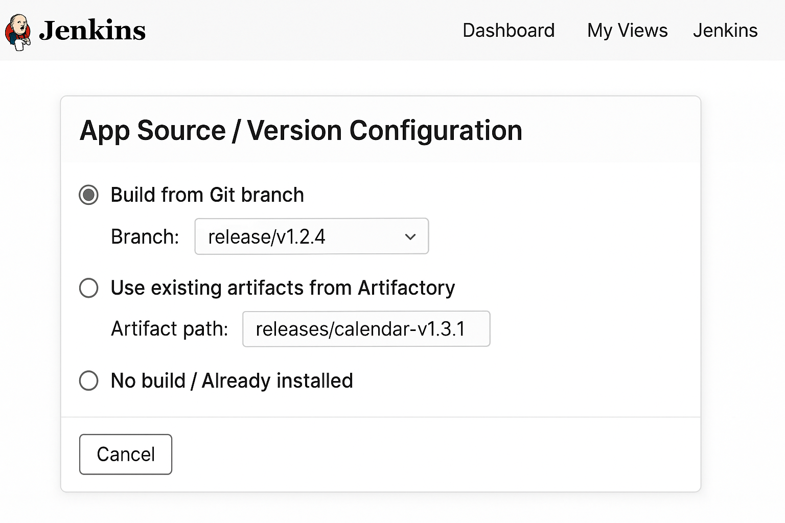
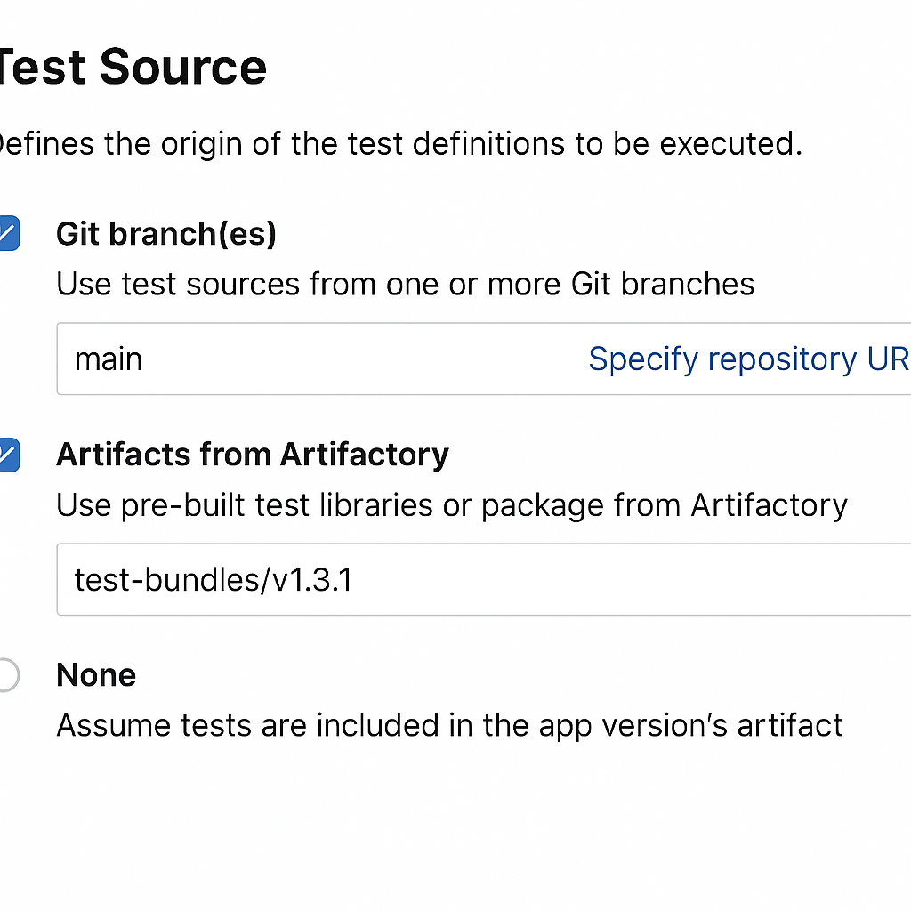
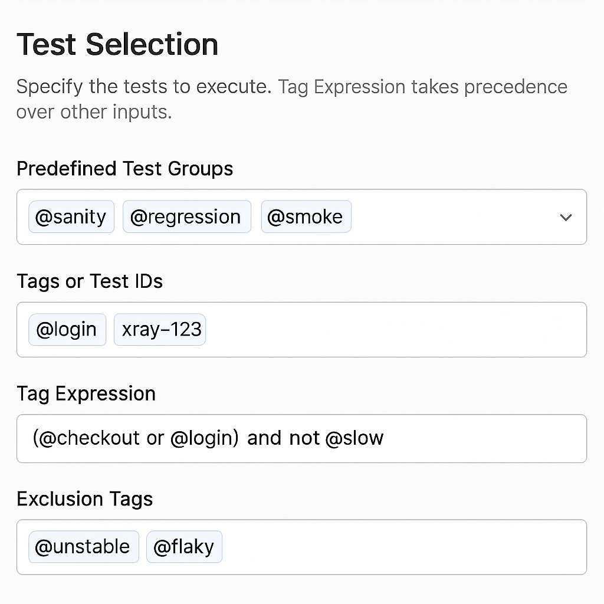
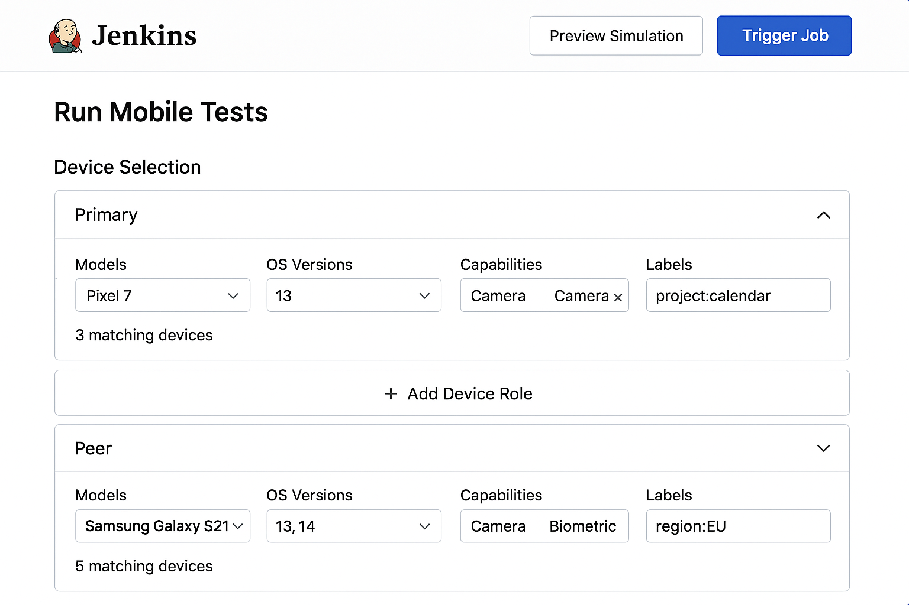

# 🧪 Executive Summary: Unified Test Trigger UI

## 📌 What Are We Building?

We're building a **Unified Test Trigger UI** to allow teams to manually initiate mobile automation tests via a clean, structured interface — starting with *Jenkins* as the first delivery vehicle.

This is not just a new form. It’s the **first official mechanism** for test execution and will serve as the **execution contract** for all future trigger systems, including Bitbucket, Xray, and APIs.

---

## 😱 Why Now?

- Teams use **manual test flows** or **fragmented homegrown automation**
- No **standard trigger method**, leading to coordination bottlenecks
- DevOps and QA are overwhelmed supporting multiple approaches
- System and device resources are under strain from uncoordinated usage

If we don’t standardize now, we risk:
- ❌ Each team building its own automation system
- ❌ Increased ops overhead and DevOps burnout
- ❌ Inconsistent test results and no shared visibility

---

## ✅ What It Enables

- QA, developers, and leads can run targeted test suites via UI
- Consistent selection of app version, device roles, and test scope
- Dry-run preview of test/device matrix before execution
- Clean JSON contract for backend execution — decouples UI from Jenkins

---

## 🔗 Strategic Impact

- **Unblocks future trigger interfaces** — Bitbucket, Jira/Xray, and APIs
- Aligns all teams to a **single execution framework**
- Reduces tool sprawl and technical debt
- Makes shared automation infra manageable and scalable

---

## 🧭 Initial Scope (Phase 1)

- Jenkins UI trigger (Git branch, Artifactory path, or pre-installed)
- Test tag selection and expressions
- Device group filtering (model, OS, capabilities)
- Global execution options (parallelism, retries, dry-run)
- JSON output to Trigger Listener

---

## 📊 Success Metrics

| Metric | Goal |
|--------|------|
| % of test runs triggered via UI | > 60% in 30 days |
| Avg time to configure a run | < 2 minutes |
| Dry run prevents execution errors | > 90% |
| Trigger job misconfigs | ↓ 50% |

---

## 📣 Call to Action

- ✅ Approve scope and Jenkins-based MVP
- 🤝 Align backend teams on trigger contract
- 🔜 Begin UI development and backend simulation APIs

---

# 📘 Full PRD

# 🧪 Unified Test Trigger UI – PRD

## TL;DR

This PRD proposes a rich, flexible **Unified Test Trigger UI** for initiating mobile automation tests manually. Initially implemented in Jenkins, this interface will empower QA, developers, and team leads to define test scope, app versions, and execution environments — without needing CLI access or brittle scripting. This is the first official trigger in the automation ecosystem and lays the foundation for future trigger capabilities across Bitbucket, Xray, and APIs.

---

## ❗Problem Statement

Today, there is **no unified, reliable way** to trigger automated tests across teams. While several automation systems currently exist, many teams still rely entirely on manual testing. This fragmented landscape creates several critical problems:

* ❌ No official or consistent method for triggering automation
* ❌ Teams risk building **siloed automation workflows**, each with their own tools, formats, and interfaces
* ❌ DevOps and QA must support multiple systems and inconsistent pipelines
* ❌ Difficult to manage shared compute resources (devices, runners, environments)
* ❌ No centralized visibility into test execution across projects

If each team continues developing its own test infrastructure, the result will be operational chaos — fractured tooling, redundant infrastructure, and bottlenecks for shared teams.

This PRD introduces a **Unified Test Trigger UI** — implemented first via Jenkins — to establish a **standard interface and contract for executing mobile automation tests**. It’s the foundation for building a scalable, team-agnostic automation ecosystem.

In the initial rollout, the Jenkins UI will serve as the **primary interface** for triggering tests across QA, developers, and team leads. Until other mechanisms are implemented (Bitbucket annotations, Jira/Xray triggers, API access), Jenkins will be the entry point for automation workflows.

**Critically**, this Jenkins trigger will also define the **execution contract and user interaction model** that all future triggers must follow — making this the foundational pattern for a scalable, unified automation ecosystem.

---

## 🌟 Goals

* Enable manual triggering of test runs through a user-friendly UI
* Provide a clean, flexible interface for test scope, version, and device selection
* Support validation and simulation of test plans before execution
* Integrate cleanly with the underlying test orchestration backend
* Lay the foundation for a unified, multi-trigger test execution architecture

---

## 👥 Target Users

* QA Engineers
* Developers
* Team Leads
* Release Engineers

---

## ✨ User Flow

Imagine a QA lead validating a hotfix on Friday:


1. **Open the Unified Test Trigger UI**  
   The user clicks “Run Mobile Tests” in Jenkins or the relevant entry point.

2. **Select App Source (Version Under Test)**  
   - Chooses `release/v1.2.4` from Git branch  
   - Jenkins builds app and attaches artifacts automatically

3. **Select Test Sources** *(optional)*  
   - Picks `main` from a separate test repo and one Artifactory test bundle

4. **Choose Test Scope**  
   - Selects `@smoke`, `@login`, and `xray-123`  
   - Adds exclusion: `@flaky`  
   - UI warns: “Tag Expression overrides other selectors” if user types `(@checkout or @login) and not @slow`

5. **Define Device Roles**  
   - Adds 2 roles:  
     - `primary`: Pixel 7, OS 13, label `project:calendar`  
     - `peer`: Galaxy S21, OS 13–14, label `region:EU`  
   - Jenkins UI shows matching devices per role

6. **Configure Execution Options**  
   - Enables `parallel_execution`  
   - Sets `retry_failed = 2`, `fail_fast = true`, `timeout = 30 mins`  
   - UI shows tooltip: “Fail Fast overrides Retry”

7. **Run a Dry Simulation**  
   - Toggles “Dry Run”  
   - Backend simulates test matrix  
   - UI output panel shows:  
     ✅ 12 test cases matched  
     📱 2 primary devices × 3 peer devices  
     🧪 72 test executions total  
     ⚠️ Warning: 1 tag not found, 1 role had 0 device matches (if applicable)

8. **Confirm and Trigger Job**  
   - If Dry Run looks good, user disables Dry Run  
   - Clicks “Trigger Job” to send final JSON payload

---

## 🧹 Core Functional Sections

### 1. 🔗 Trigger Metadata

> **Purpose:**  
> Define the **origin**, **ownership**, and **audit context** for a test trigger.  
> Required for all invocation sources — Jenkins, Bitbucket, API, Xray, Slack, or Cron.

This metadata enables analytics, routing, observability, and post-execution updates to the initiator system. It is **always included**, regardless of test content or source strategy.

---

#### 📦 JSON Structure

```json
"trigger_metadata": {
  "source": "jenkins",
  "initiated_by": "qa.lead@company.com",
  "requested_at": "2025-07-18T14:52:00Z",
  "source_job_id": "Run-Mobile-Automation-#143",
  "tracking_id": "abcd-1234-efgh-5678",
  "priority": "high"
}
```
#### 🧷 Field Reference

| Field           | Type     | Required   | Description                                                                 |
|----------------|----------|------------|-----------------------------------------------------------------------------|
| `source`        | string   | ✅ Yes     | Origin of trigger. Valid: `jenkins`, `bitbucket`, `xray`, `api`, `slack`, `cron` |
| `initiated_by`  | string   | ✅ Yes     | Username, email, or system that triggered the job                          |
| `requested_at`  | datetime | ✅ Yes     | ISO 8601 timestamp of trigger initiation                                   |
| `source_job_id` | string   | ⬜ Optional | Triggering entity ID (e.g., Jenkins job name, PR ID, Xray test plan)       |
| `tracking_id`   | string   | ⬜ Optional | Globally unique correlation ID for cross-system logs or retries            |
| `priority`      | string   | ⬜ Optional | Execution priority: `normal`, `high`, `urgent` (affects queue or alerting) |

#### ⚙️ Behavior & Usage

- Always included in the root payload as `"trigger_metadata": { ... }`.
- Enables log correlation, alert routing, and deduplication in backend services.
- `tracking_id` can be reused across retries or re-runs.
- `priority` can influence job scheduling and monitoring alerts.
- `source_job_id` links the test job back to Jenkins, Bitbucket, or Xray for UI traceability.

---

### 📦 2. Source / Version Under Test

**🌟 Purpose:**
Define how the app version and artifacts (APK, JAR, AAR, etc.) are linked to the test run.

The user selects one of the following **three mutually exclusive options**:

#### 🔘 Option 1: Build from Git Branch

*(Used for daily CI automation and feature validation)*

* **User Input:**
  Dropdown list of branches (e.g., `main`, `develop`, `release/v1.2.4`, `feature/1234-2FA`)

* **Behavior:**

  * Jenkins clones the selected Git branch
  * Builds the required artifacts
  * Uploads them to Artifactory and validates presence
  * Generates JSON for the Trigger Listener

* **JSON Output:**

```json
{
  "source": {
    "type": "build_from_branch",
    "git_branch": "release/v1.2.4",
    "commit": "HEAD",
    "artifact_path": "artifactory/releases/calendar-v1.2.4/",
    "artifacts": [
      "calendar.apk",
      "test-lib.jar"
    ]
  }
}
```

📜 *If no artifacts are specified, the Trigger Listener may infer default filenames (e.g., `calendar.apk`) or retrieve all files under the provided path.*

---

#### 🔘 Option 2: Use Existing Artifacts from Artifactory

*(Used for retesting known app versions)*

* **User Input:**
  Dropdown or free-text field (e.g., `releases/calendar-v1.3.1`)

* **Behavior:**

  * Validates that the artifact path exists
  * Optionally lists specific artifacts
  * Generates JSON for the Trigger Listener

* **JSON Output:**

```json
{
  "source": {
    "type": "existing_artifacts",
    "artifact_path": "artifactory/releases/calendar-v1.3.1/",
    "artifacts": [
      "calendar.apk",
      "test-lib.jar"
    ]
  }
}
```

📜 *If no artifacts are specified, the Trigger Listener may infer default filenames (e.g., `calendar.apk`) or retrieve all files under the provided path.*

---

#### 🔘 Option 3: No Build / No Artifact Download

*(Used when the app is already installed on the target devices)*

* **Behavior:**

  * No build, no validation
  * App is assumed to be pre-installed
  * JSON still generated for test execution

* **JSON Output:**

```json
{
  "source": {
    "type": "pre_installed"
  }
}
```

---

#### 🛠️ UI Behavior

* One option must be selected:
  `Build from Git Branch` | `Use Existing Artifacts` | `No Build / Pre-installed`
* Relevant inputs are shown dynamically

---

#### ✅ Summary Table

| Mode                         | Jenkins Builds? | Validates Artifacts? | Downloads? | App Pre-installed? | JSON Fields Included                                |
| ---------------------------- | --------------- | -------------------- | ---------- | ------------------ | --------------------------------------------------- |
| Build from Branch            | ✅ Yes           | ✅ Yes (after upload) | ❌ No       | ❌ No               | `git_branch`, `artifact_path`, optional `artifacts` |
| Use Existing Artifacts       | ❌ No            | ✅ Yes                | ❌ No       | ❌ No               | `artifact_path`, optional `artifacts`               |
| No Build / Already Installed | ❌ No            | ❌ No                 | ❌ No       | ✅ Yes              | `type: pre_installed`                               |

---

#### ✅ Jenkins UX

<p align="center">
  
</p>


---
### 🧪 3. Test Source

> 📝 **Note:** This section is **optional** if the test sources are already bundled with the source artifacts in the *Source / Version Under Test* section.

If test definitions are **independent from the app version**, users must specify where the tests are located.

Defines the origin of the test definitions to be executed.

* **Option 1: Git Branch(es)**

  * **Purpose:** Used when test definitions are in source control and may be versioned independently. The source can be in the same or a different repository than the app.
  * **User Input:** One or more branches (e.g., `main`, `develop`, `release/v1.2.4`) with optional repository URL override if not the current project
  * **Behavior:** Jenkins fetches test definitions from the selected branches or repositories and generates the relevant test artifact paths.
  * **JSON Output:**

```json
{
  "test_sources": {
    "test_source_1": {
      "type": "git_branch",
      "branches": ["main"],
      "repository": "https://example.com/test-repo.git"
    },
    "test_source_2": {
      "type": "git_branch",
      "branches": ["main"],
      "repository": "https://example.com/test-behave-repo.git"
    }
  }
}
```

* **Option 2: Artifacts from Artifactory**

  * **Purpose:** Use pre-built test libraries or packages from Artifactory.
  * **User Input:** Path to test artifacts (e.g., `test-bundles/v1.3.1`)
  * **Behavior:** Jenkins validates the artifact path exists and references it in the test trigger payload.
  * **JSON Output:**

```json
{
  "test_sources": {
    "type": "artifactory_path",
    "path": "test-bundles/v1.3.1"
  }
}
```

* **Option 3: None**

  * **Purpose:** Assumes tests are already included in the app version's artifact and no additional test path is needed.
  * **User Input:** None
  * **Behavior:** No test-specific source is added; tests are assumed bundled in app source.
  * **JSON Output:**

```json
{
  "test_sources": {
    "type": "none"
  }
}
```
#### 🛠️ UI Behavior

* User can choose one or more test sources.
* Test sources are grouped in a list format with ability to add/remove items.
* Each source is labeled and validated individually.
* Repository field is optional when source is same as app repository.

---
#### ✅ Jenkins UX

<p align="center">
  
</p>
---

#### ✅ Summary Table

| Mode                    | Source Type       | Requires Repo? | Jenkins Validates? | Can Be Multiple? | JSON Format         |
| ----------------------- | ----------------- | -------------- | ------------------ | ---------------- | ------------------- |
| Git Branch              | git\_branch       | ✅ Optional     | ✅ Yes              | ✅ Yes            | test\_sources array |
| Artifactory Test Bundle | artifactory\_path | ❌ No           | ✅ Yes              | ✅ Yes            | test\_source object |
| No Additional Source    | none              | ❌ No           | ❌ No               | ❌ No             | test\_source object |

---

#### 🧾 Combined JSON Output Example

```json
{
  "test_sources": {
    "test_source_1": {
      "type": "git_branch",
      "branches": ["main"],
      "repository": "https://example.com/test-repo.git"
    },
    "test_source_2": {
      "type": "artifactory_path",
      "path": "test-bundles/v1.3.1"
    }
  }
}
```

---
### 4. Test Selection

Select the specific tests to execute from the defined sources. Users can mix and match selection methods unless a Tag Expression is used, which overrides all others.

---

#### 🔹 Multi-select Predefined Test Groups

**Purpose:**  
Run common sets of tests by category (e.g., regression, sanity).

**User Input:**  
Checkbox/multi-select dropdown (e.g., `@sanity`, `@regression`, `@smoke`)

**Behavior:**  
Resolves to associated tags and includes them in the test selection set.

**JSON Output:**
```json
{
  "test_groups": ["@sanity", "@smoke"]
}
```

#### 🔹 Free-text Input for Tags or Test IDs

**Purpose:**  
Target specific test scopes such as login flows or specific Jira cases.

**User Input:**  
Free-text field (e.g., `@login`, `xray-123`, `@2FA`)

**Behavior:**  
Parsed into individual tag references for inclusion.

**JSON Output:**
```json
{
  "test_tags": ["@login", "xray-123", "@2FA"]
}
```

#### 🔹 Tag Expression

**Purpose:**  
Use boolean logic to define complex test targeting rules.

**User Input:**  
Expression field (e.g., `(@checkout or @login) and not @slow`)

**Behavior:**  
If provided, this input **overrides all other test selection methods** — including predefined groups, tags, and exclusions. The tag expression becomes the sole selector.

**JSON Output:**
```json
{
  "tag_expression": "(@checkout or @login) and not @slow"
}
```

#### 🔹 Exclusion Tags

**Purpose:**  
Filter out unwanted tests such as flaky or unstable ones.

**User Input:**  
Free-text field (e.g., `@unstable`, `@flaky`)

**Behavior:**  
Removes any matching tags from the test set after positive selections have been made.  
Ignored if a Tag Expression is provided (which takes full control).

**JSON Output:**
```json
{
  "exclude_tags": ["@unstable", "@flaky"]
}
```
---

#### ⚙️ Selection Logic Priority

1. If a **Tag Expression** is provided → it **overrides all other test selection inputs**.
2. If no Tag Expression is provided:
   - Combine:
     - Predefined test groups (`test_groups`)
     - Free-text tags or test IDs (`test_tags`)
   - Then apply `exclude_tags` to filter out unwanted tests

> ⚠️ UI should clearly alert: “Tag Expression overrides all other selection inputs.”

---

#### 🧪 Example Combined Payload

```json
{
  "simulate": true,
  "test_selection": {
    "test_groups": ["@sanity", "@smoke"],
    "test_tags": ["@login", "xray-123"],
    "exclude_tags": ["@unstable"]
  }
}
```
---
#### ✅ Jenkins UX

<p align="center">
  
</p>

---

### 5. Device Selection

Define what types of devices are needed to run the test.  
Each **Device Role** represents one required device in the execution matrix (e.g., `primary`, `receiver`, `peer`, etc.).

Most tests require only a single role. More complex tests (like peer-to-peer, multi-user chat, etc.) may define multiple roles.

---
#### 🔹 Device Role Definition

Each Device Role contains one filter group:

| **Field**       | **Description**                                                                 |
|------------------|---------------------------------------------------------------------------------|
| **Role Name**    | A user-defined identifier (e.g., `primary`, `receiver`, `peer`)                |
| **Models**       | Optional list. e.g., `Pixel 7`, `Samsung S21`                                  |
| **OS Versions**  | Optional list. e.g., `13`, `14`, `15`                                           |
| **Capabilities** | Optional list. e.g., `Camera`, `Biometric`, `NFC`, `5G`                         |
| **Labels**       | Optional. Org/project-specific metadata (e.g., `project:calendar`, `EU`)        |

---

#### 🛠️ Behavior

- All matching devices **within a role** must share the same capabilities  
- Devices **across different roles** can differ — each is matched independently  
- UI starts with a default single role (`primary`)  
- Users can click “➕ Add Device Role” to define multiple roles  
- Each role is shown in a separate card with a live preview of matching devices  

---

#### ✅ JSON Payload Example

```json
"device_roles": {
  "primary": {
    "models": ["Pixel 7"],
    "os_versions": ["13"],
    "capabilities": ["Camera"],
    "labels": ["project:calendar"]
  },
  "peer": {
    "models": ["Samsung Galaxy S21"],
    "os_versions": ["13", "14"],
    "capabilities": ["Camera", "Biometric"],
    "labels": ["region:EU"]
  }
}
```

---

#### 🎯 JSON Summary by Execution Mode

| Mode                           | Device Roles in JSON                                    | Execution Matrix Impact                                                         |
| ------------------------------ | ------------------------------------------------------- | ------------------------------------------------------------------------------- |
| Single-role tests (primary)    | `device_roles: { "primary": { ... } }`                  | `#tests × #primary devices`                                                     |
| Multi-role tests (primary + X) | `device_roles: { "primary": { ... }, "peer": { ... } }` | `#tests × #primary devices × #peer devices`                                     |
| Dry Run Mode                   | `simulate: true` included in root JSON                  | Server simulates all possible combinations, warns if any role has 0 matches     |
| Execution Mode (real run)      | `simulate: false` (or omitted)                          | Server allocates devices and executes based on matrix, skipping unmatched roles |

---
#### 🔖 Label Matching Rules

**Labels** are used to match devices by project metadata, geographic assignment, or custom tags (e.g., `project:calendar`, `region:EU`, `lab:berlin`).

**Matching Logic:**

- A device must match **all** labels listed in a role’s filter.
- Matching is **case-sensitive** and must be an **exact string match**.
- This logic uses **AND** semantics — not OR.

**Example:**

```json
"labels": ["project:calendar", "region:EU"]
```

| ✅ **Matches**          | A device labeled with both `project:calendar` **and** `region:EU`.                            |
|-------------------------|-----------------------------------------------------------------------------------------------|
| ❌ **Excludes**         | Devices with **only one** of the labels (e.g., just `project:calendar` or just `region:EU`).  |
| ⚠️ **Dry Run Behavior** | Devices not matching **all specified labels** will be excluded from previews and execution.   |

---

#### ⚠️ UI Considerations

- Each Device Role is **collapsible** for clarity  
- **"No match" warning** shown during Dry Run if any role has 0 available devices  
- **Label filters** are applied only if present in device metadata  
- Users can **save role configurations as reusable presets** per team/project


#### ✅ Jenkins UX

<p align="center">
  
</p>
---

### 6. Execution Options (Global)

These options apply across the entire test job and affect all tests and devices.

| **Option**             | **Type**           | **Description**                                                  |
|------------------------|--------------------|------------------------------------------------------------------|
| **Parallel Execution** | Boolean (toggle)   | Run tests in parallel across available devices. Default: `false`. |
| **Retry Failed Tests** | Number (`0–3`)     | Retry each failed test-case up to N times. Default: `0`.         |
| **Fail Fast**          | Boolean (toggle)   | Abort all test execution on first failure. Default: `false`. ⚠️ If both enabled, this takes precedence over `retry_failed`.    |
| **Timeout**            | Number (minutes)   | Total time allowed for the job. `0` means no timeout. Default: `60`. |

> 🔁 **Note:** Dry Run is handled separately in [Section 6 – Dry Run & Output Preview](#7-dry-run--output-preview).  
> 💡 Preset saving is a future feature and excluded from MVP.

---

#### ✅ JSON Example

```json
{
  "execution_options": {
    "parallel_execution": true,
    "retry_failed": 2,
    "fail_fast": true,
    "timeout_minutes": 30
  }
}
```
#### 🔍 Backend Behavior by Field

| **Field**             | **Type** | **Valid Values**        | **If Missing**       | **If Invalid**                    |
|-----------------------|----------|--------------------------|----------------------|-----------------------------------|
| `parallel_execution`  | Boolean  | `true`, `false`          | Defaults to `false`  | Treated as `false`                |
| `retry_failed`        | Number   | `0–3`                    | Defaults to `0`      | Out of range → fallback to `0`    |
| `fail_fast`           | Boolean  | `true`, `false`          | Defaults to `false`  | Treated as `false`                |
| `timeout_minutes`     | Number   | `0–180` (e.g., 3 hours)  | Defaults to `60`_


> ⏱️ **Note:** Timeout applies to the entire test job. It begins at execution start and includes all devices and test cases.

#### ⚠️ Combined Behavior: `fail_fast` vs `retry_failed`

If both options are enabled:

> **Fail Fast wins.**  
> The system **immediately stops execution** on the first failure, and **does not retry** that or any subsequent tests.

This prevents conflicting expectations and simplifies orchestration logic.


---

### 7. 🧪 Dry Run & Output Preview

The **Dry Run** capability allows users to simulate a test run before triggering actual execution. This ensures selected tests and device filters result in a meaningful, executable matrix — reducing waste, errors, and frustration.

#### 🔹 Dry Run Toggle

**Purpose:**  
Simulate the test/device matrix before actual execution.

**User Input:**  
- Checkbox toggle labeled: `🧪 Dry Run (simulate only, no tests will be run)`

**Behavior:**  
- Sends a request to the `/simulate` endpoint on the backend (Test Planner).
- Simulation evaluates current selections:
  - Source artifacts  
  - Test definitions  
  - Tags and test scope  
  - Device roles and capabilities  

**Backend Contract – JSON Output:**
```json
{
  "simulate": true
}
```
---
#### 🛠️ UX Notes

- ✅ **Simulation is automatic** when the form is valid and Dry Run is selected.
- 🚨 **Dry run mode is clearly labeled** in the job summary (confirmation screen).
- ↪️ If Dry Run is selected, the primary action becomes **“Preview Simulation”** instead of “Trigger Job”.
- 📦 **Dry Run is stateless** — it does not:
  - Trigger builds
  - Reserve devices
  - Create/persist jobs
---
#### 🔎 Output Preview Panel

**Purpose:**  
Provide users with a clear and immediate summary of what their test run would look like — before actually running it.

**Behavior:**  
- Appears only after a successful Dry Run (`/simulate` call)
- Dynamically renders the simulation result, including:

  - ✅ **Total matching test cases**
  - 📱 **Selected device roles**
  - 🧪 **Execution matrix** (tests × devices)
  - ⚠️ **Warnings** if:
    - No tests matched
    - No available devices
    - Tags not found or excluded

**Example UI Output (simulated):**
```yaml
✅ 12 tests matched  
📱 Devices: Samsung Galaxy S21, Pixel 7, Xiaomi Mi 11  
🧪 Execution matrix: 12 tests × 2 primary devices × 3 peer devices = 72 executions  
⚠️ 1 tag was unmatched: @nonexistent-tag
```
---
#### 🧪 Example Combined Simulation Payload

**Payload sent to `/simulate` to generate the Output Preview Panel:**

```json
{
  "version": "1.0",
  "trigger_metadata": {
    "source": "jenkins",
    "initiated_by": "qa.lead@company.com",
    "requested_at": "2025-07-18T14:52:00Z",
    "source_job_id": "Run-Mobile-Automation-#143",
    "tracking_id": "abcd-1234-efgh-5678",
    "priority": "high"
  },
  "simulate": true,
  "source": {
    "type": "build_from_branch",
    "git_branch": "release/v1.2.4",
    "artifact_path": "artifactory/releases/calendar-v1.2.4/",
    "artifacts": ["calendar.apk", "test-lib.jar"]
  },
  "test_sources": {
    "test_source_1": {
      "type": "git_branch",
      "branches": ["main"],
      "repository": "https://example.com/test-repo.git"
    }
  },
  "test_selection": {
    "test_groups": ["@sanity", "@smoke"],
    "test_tags": ["@login", "xray-123"],
    "exclude_tags": ["@unstable"]
  },
  "device_roles": {
    "primary": {
      "models": ["Pixel 7"],
      "os_versions": ["13"],
      "capabilities": ["Camera"],
      "labels": ["project:calendar"]
    },
    "peer": {
      "models": ["Samsung Galaxy S21"],
      "os_versions": ["13", "14"],
      "capabilities": ["Camera", "Biometric"],
      "labels": ["region:EU"]
    }
  },
  "execution_options": {
    "parallel_execution": true,
    "retry_failed": 2,
    "fail_fast": true,
    "timeout_minutes": 30
  }
}
```
---
#### ⚠️ UI Considerations – Dry Run & Simulation

- ❗ **No Matching Tests**  
  If no tests match the current filters, the **Preview Panel** should display with a **red border** and a clear CTA:  
  _“No tests matched your filters. Please adjust tags or groups.”_

- ⚠️ **Partial Match Warnings**  
  If some test cases are unavailable on selected devices or are filtered out, show a **non-blocking warning**.  
  These should **not prevent execution**, but should help the user optimize their selections.

- 🧼 **Dry Run Must Be Stateless and Lightweight**

  - ❌ No test jobs are triggered  
  - ❌ No devices are reserved  
  - ❌ No artifacts are downloaded or installed  

  The simulation process must **not consume infrastructure resources** and should return results near-instantly.


---

## 📊 Success Metrics

| Metric                                      | Target               | Rationale                                 |
| ------------------------------------------- | -------------------- | ----------------------------------------- |
| % of test runs triggered via UI             | > 60% within 1 month | Shows adoption by QA/release teams        |
| Average time to configure run               | < 2 minutes          | Confirms improved efficiency              |
| % of dry runs that prevent execution errors | > 90%                | Proves simulation is reducing failed runs |
| Trigger job error rate                      | Reduced by 50%       | Fewer misconfigured jobs                  |

---

## 🚰 Technical Considerations

* **Form Validation:** Tag syntax, required fields, APK existence
* **Data Sources:**

  * Git: for branch lists
  * Artifactory: for APK/JAR paths
  * STF or farm service: for real-time device availability and specs
* **Dry Run Simulation:**

  * Sends request to `/simulate` endpoint in Test Planner
  * Returns matched tests and device execution matrix
* **Security:**

  * Role-based UI access
  * Audit trail of who ran what, when
* **Presets:**

  * Stored in config backend
  * Shared across teams or roles

---

## 🩱 Influence on Future Trigger Architecture

This UI and interaction model defines the **canonical contract** for future triggers, including:

* Bitbucket commit triggers with `@automation` annotations
* Xray test-case-level buttons (“Run Tests”)
* REST API triggers via external systems
* Trigger Listener contract standardization
* JSON-first execution abstraction decoupled from Jenkins

---

## 🚀 Optional Enhancements
These features are not included in the MVP but may be considered for future iterations to improve usability, team collaboration, and test orchestration efficiency.


* **Template Sharing:** Save/load/share full test configurations
* **Run Again:** Re-run previous job with same config
* **Live Error UX:** Real-time validation of missing APKs, bad tags, no devices
* **Bitbucket/Xray Integration:** Trigger runs via Git or Jira

---

## ✅ Acceptance Criteria

* [ ] Users can select test scope using tags and groups
* [ ] Users can define the app source using Git, Artifactory, or skip
* [ ] Device roles can be created and filtered
* [ ] Global execution options are configurable
* [ ] JSON is always sent to Trigger Listener on successful job start
* [ ] Errors are handled clearly (missing branches, missing APKs, no test match)
* [ ] Dry run toggle in UI triggers simulation and returns accurate preview panel
* [ ] Dry run returns valid preview of test/device matrix
* [ ] JSON schema is validated before sending to Trigger Listener
